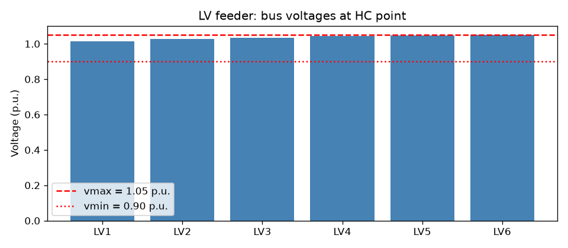
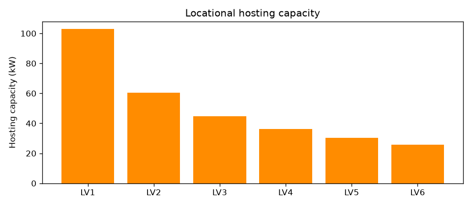
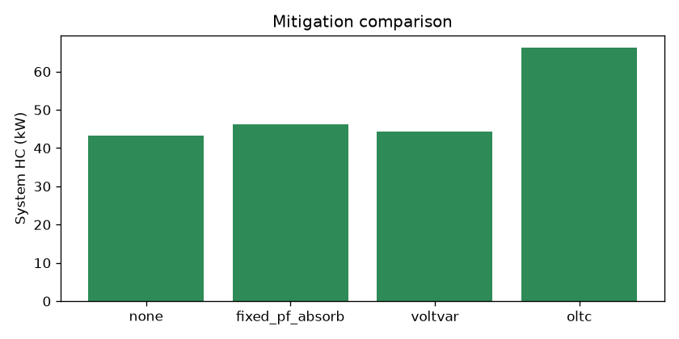

# pvhostcap

**Deterministic PV hosting-capacity screening for distribution feeders, built on [pandapower](https://www.pandapower.org/).**

How much rooftop PV can a feeder take before something breaks — and *where*
exactly does it break first? `pvhostcap` answers both with a fast,
deterministic screening workflow: a bisection search over PV size against
voltage and thermal limits, for the whole feeder and bus by bus.

## Why another hosting-capacity tool?

The heavyweight options exist — NREL's [disco](https://github.com/NREL/disco)
(HPC-scale, OpenDSS-based), stochastic Monte-Carlo studies, MILP optimal-sizing
formulations. They are powerful but slow to set up and overkill for the
industry's actual first step: the **deterministic worst-hour screening**
(minimum load / maximum PV) that decides whether a feeder needs a deeper
study at all (see Mulenga et al., 2020 for the method taxonomy).

`pvhostcap` fills the lightweight end:

- **pandapower-native** — no OpenDSS, no MILP solver, plain Newton-Raphson
  load flow. A full feeder screening runs in seconds.
- **Two questions, not one** — the *system* HC (uniform PV spread) *and* the
  *locational* HC map: how much each individual bus can host on its own.
  The locational map is what a DSO actually needs for connection offers,
  and it is the output most screening scripts skip.
- **Binding-constraint diagnostics** — every result names the exact bus or
  line that binds and by how much, so you know *why* the number is what it is.
- **Mitigation comparison built in** — re-run the same search under classic
  enhancement measures (reactive-power control, OLTC tap change) and see the
  HC gain side by side.

## Method

1. Build (or supply) a radial feeder as a pandapower net.
2. Evaluate one PV allocation: attach PV as static generators, run the load
   flow, check `vmax` / line / transformer limits. A non-converged load flow
   counts as infeasible.
3. **System HC**: bisect on the uniform per-bus PV size. Feasibility is
   monotone decreasing in PV size, so bisection is exact up to the tolerance.
4. **Locational HC**: repeat the bisection per bus, all other buses at zero PV.
5. **Mitigations**: the same search with a strategy applied before each load
   flow — constant-PF absorption, Q(U) Volt-VAr droop (fixed-point iteration),
   or an OLTC tap move.

Assumptions are stated up front: single worst-hour snapshot, balanced
three-phase model, PV allocated per load bus (rooftop-PV screening
convention). Uncertainty and time series are deliberately out of scope —
see the references for those treatments.

## Quickstart

```bash
pip install pandapower matplotlib
pip install pvhostcap            # or: pip install -e .  from a checkout
python examples/quickstart.py
```

```python
from pvhostcap import (
    build_lv_radial, system_hosting_capacity,
    locational_hosting_capacity, compare_strategies,
)

net, load_buses = build_lv_radial()          # built-in 0.4 kV test feeder

hc = system_hosting_capacity(net, load_buses)
print(hc)
# HC = 43.31 kW total (7.22 kW x 6 buses), binding: overvoltage at bus LV6

loc = locational_hosting_capacity(net, load_buses)   # weak-bus map
comp = compare_strategies(net, load_buses)           # mitigation comparison
```

`examples/quickstart.py` runs the full workflow end to end and saves the
figures below into `examples/output/`.

## Example results

Built-in LV feeder (0.4 kV, six load buses, NAYY 4x50 SE cables):

| analysis | result |
|---|---|
| System HC | **43.31 kW** (7.22 kW × 6 buses) |
| Binding constraint | overvoltage at **bus LV6** (far end): 1.0503 p.u. |
| Locational HC | LV1 **102.9** → LV2 60.4 → LV3 44.8 → LV4 36.1 → LV5 30.2 → LV6 **25.8 kW** |




Mitigation comparison on the same feeder:

| strategy | system HC | vs baseline |
|---|---|---|
| none (baseline) | 43.31 kW | — |
| fixed power factor 0.95 (absorb) | 46.31 kW | +6.9% |
| Q(U) Volt-VAr droop | 44.25 kW | +2.2% |
| OLTC tap −5% on LV side | 66.19 kW | **+52.8%** |



The MV feeder (10 kV, five 400 kW load buses) tells the opposite story:
system HC **7.60 MW**, binding on the **head-end line thermal limit**
(100.4%), voltage only reaching 1.03 p.u. — the same tool, a different
bottleneck, which is exactly what the diagnostics are for.

### Honest findings

- On the LV feeder, constant-PF absorption beats Q(U) droop (+6.9% vs +2.2%).
  The droop only acts above its 1.03 p.u. deadband, so near-transformer
  inverters contribute nothing — a reminder that "smart" control is not
  automatically better; it depends on the feeder.
- The OLTC move dominates (+52.8%) because this feeder is purely
  voltage-bound. On the thermally-bound MV feeder it does nothing.
- Deterministic screening is optimistic by construction: it ignores
  load/PV uncertainty and phase imbalance. Treat the numbers as a
  first-pass screen, not a connection guarantee.

## Tests

```bash
pip install -e ".[test]"
pytest            # 22 tests, incl. physics checks:
                  # far-end bus is weakest, mitigations never hurt HC,
                  # LV feeder voltage-bound / MV feeder thermal-bound
```

## References

- Brohi, N.A. et al. "Advances in Hosting Capacity Assessment and
  Enhancement Techniques for Distributed Energy Resources: A Review of
  Dynamic Operating Envelopes in the Australian Grid." *Energies* 18(11),
  2922 (2025). — method taxonomy (deterministic / stochastic / time-series /
  AI-based) and enhancement techniques.
- Mulenga, E., Bollen, M.H.J., Etherden, N. "A review of hosting capacity
  quantification methods for photovoltaics in low-voltage distribution
  grids." *Int. J. Electr. Power Energy Syst.* 115, 105445 (2020). —
  the deterministic-screening baseline this tool implements.
- Bollen, M.H.J., Hassan, F. *Integration of Distributed Generation in the
  Power System.* Wiley-IEEE Press (2011). — the original "hosting capacity
  approach".
- Shen, C. et al. "Kullback–Leibler Divergence-Based Distributionally Robust
  Chance-Constrained Programming for PV Hosting Capacity Assessment."
  *Scientific Reports* (2024). — how the literature handles PV uncertainty;
  explicitly out of scope here.

Related open-source work: [NREL disco](https://github.com/NREL/disco)
(HPC-scale HC analysis), [skortmann/probabilistic-pv-hosting-capacity](https://github.com/skortmann/probabilistic-pv-hosting-capacity)
(probabilistic, SimBench LV grids).

## License

BSD-3-Clause. See [LICENSE](LICENSE).
